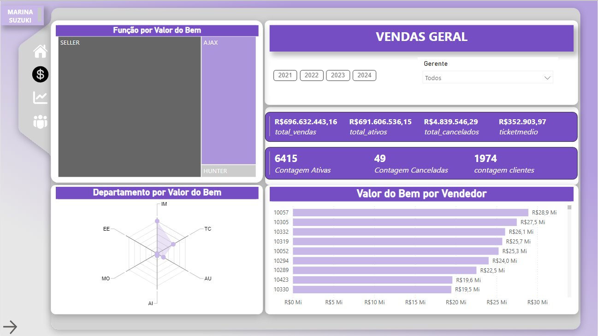
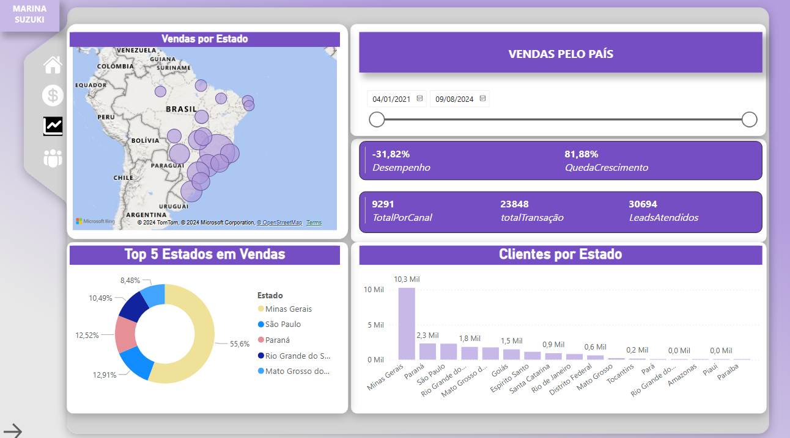
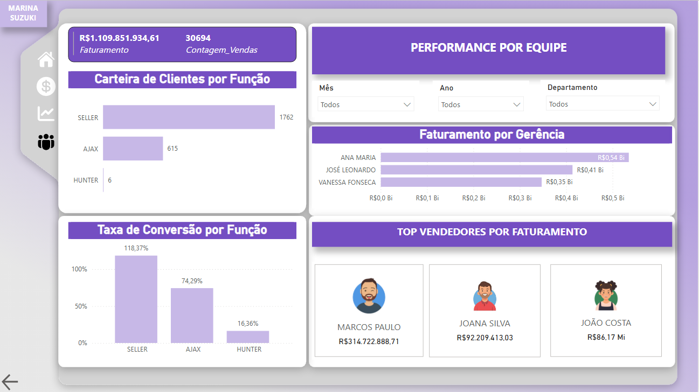

# 📈 Dashboard de Vendas – Figma (Painel Fictício)

Este foi meu **primeiro dashboard desenvolvido no Figma**, criado com base em uma empresa fictícia do setor de vendas.

🎯 O objetivo foi estruturar um painel visualmente agradável, claro e informativo, simulando um cenário real de acompanhamento de performance comercial.

---

## 🧩 Estrutura do Painel

O dashboard é composto por **três páginas principais**, organizadas da seguinte forma:

### 🖥️ 1. Vendas Geral
- Visão macro de vendas da empresa
- Total de vendas em valor e quantidade
- Indicadores principais (KPIs)

### 📊 2. Vendas por País
- Detalhamento das vendas por região e mês
- Permite identificar tendências sazonais e regionais

### 👤 3. Performance por Equipe
- Acompanhamento de desempenho individual e coletivo
- Destaque para vendedores com melhor performance

---

## 🖼️ Print do Dashboard

>Vendas Geral:

>Vendas por País:

>Performance por Equipe:

---

## 🔗 Visualize o painel completo

Você pode acessar o dashboard no Figma através do link abaixo:

👉 [Ver dashboard]([https://www.figma.com/file/SEU-LINK-AQUI](https://app.powerbi.com/view?r=eyJrIjoiMTRmYzQ2OGEtZGY3Zi00NzdkLWJhYzQtNjg1MmQxMjZhY2YwIiwidCI6ImNkNWU2ZDIzLWNiOTktNDE4OS04OGFiLTFhOTAyMWEwYzQ1MSJ9))

---

## 🛠️ Ferramenta utilizada

- [Figma](https://figma.com) – design e estruturação visual

---

## ✨ Observações

Este projeto foi criado com fins de aprendizado e demonstração. Os dados utilizados são fictícios e servem apenas para fins ilustrativos.

